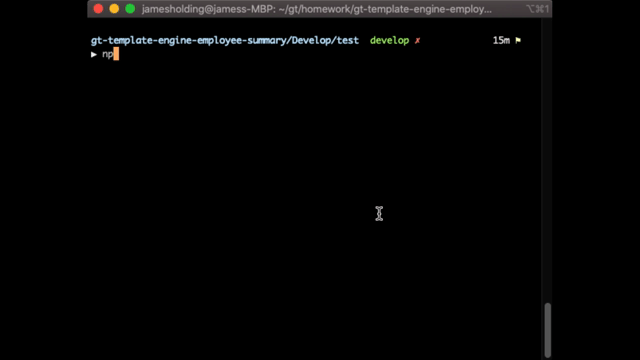

# Template Engine - Employee Summary
## Introduction
This CLI was created as a project for the Georgia Tech Coding Full-Stack program. The goal was of this project was to create a CLI that generates an html file containing the team list from the CLI input. This project makes use of Node.js, Inquirer and Jest. 

## Table of Contents
- [Introduction](#Introduction)
- [Table of Contents](#table-of-contents)
- [Installation](#installation)
- [Usage](#usage)
- [Credits](#credits)
- [License](#license)

### Installation
Clone this repo to your local machine using https://github.com/jmh129/gt-template-engine-employee-summary

### Usage
The application is for anyone that needs to quickly generate a team list using their terminal. The user will need to navigate in their terminal to the folder the files are in. Then, enter in node app.js. The prompts will appear in the terminal and the user can give its input. After the prompts have been answered a seperate file named team.html will appear. 

Example Demo:

Example Output: 

NPM Test Output:

### Credits
Credit to the Georgia Institute of Technology Coding Bootcamp for the instruction for the assignemnt. 

### License

MIT License

Copyright (c) 2020 James Holding

Permission is hereby granted, free of charge, to any person obtaining a copy
of this software and associated documentation files (the "Software"), to deal
in the Software without restriction, including without limitation the rights
to use, copy, modify, merge, publish, distribute, sublicense, and/or sell
copies of the Software, and to permit persons to whom the Software is
furnished to do so, subject to the following conditions:

The above copyright notice and this permission notice shall be included in all
copies or substantial portions of the Software.

THE SOFTWARE IS PROVIDED "AS IS", WITHOUT WARRANTY OF ANY KIND, EXPRESS OR
IMPLIED, INCLUDING BUT NOT LIMITED TO THE WARRANTIES OF MERCHANTABILITY,
FITNESS FOR A PARTICULAR PURPOSE AND NONINFRINGEMENT. IN NO EVENT SHALL THE
AUTHORS OR COPYRIGHT HOLDERS BE LIABLE FOR ANY CLAIM, DAMAGES OR OTHER
LIABILITY, WHETHER IN AN ACTION OF CONTRACT, TORT OR OTHERWISE, ARISING FROM,
OUT OF OR IN CONNECTION WITH THE SOFTWARE OR THE USE OR OTHER DEALINGS IN THE
SOFTWARE.